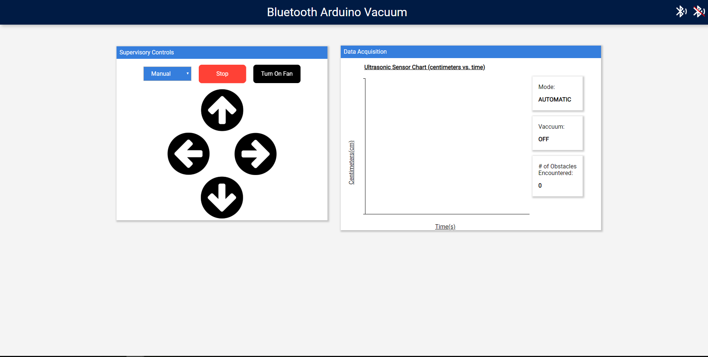

# Bluetooth Arduino Vacuum
An autonomous arduino vacuum for my Supervisory Control and Data Acquisition course.

### Materials:
- DC Motor (4)
- HC05 Bluetooth Module
- Arduino Uno
- Electric Wires
- DC 12V Fan
- Anker Power Bank
- Ultrasonic Sensor
- Twin Industries Breadboard
- Tupperware 

    

### Libraries and Tools
- Epoch.js, D3.js for data visualization
- BluetoothTerminal.js for bluetooth connectivity
- Tachyons.css for quick and easy css
- jQueryUI.js for draggable UI
- Firebase Hosting

  
